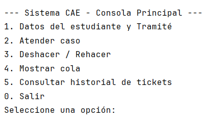
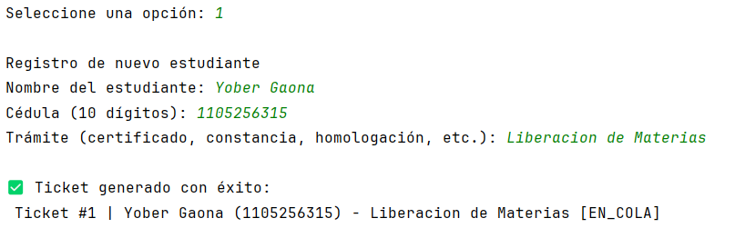
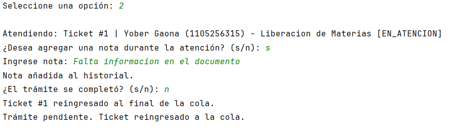
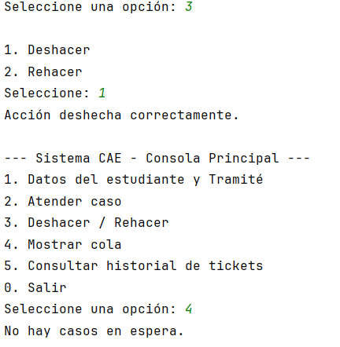
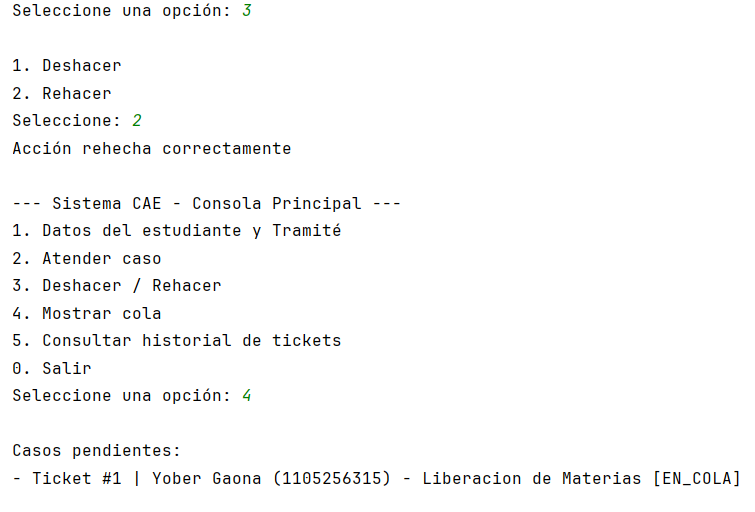
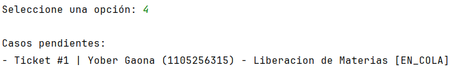
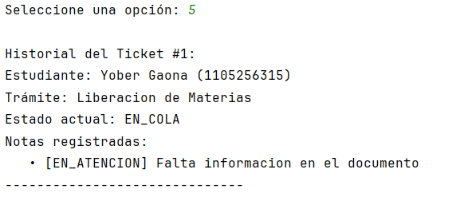
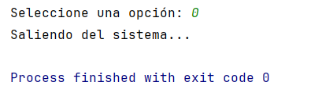

# Módulo de Gestión de Tickets — CAE (Centro de Atención al Estudiante)

## Decisiones de diseño
El sistema **CAE** fue desarrollado bajo el principio de separación entre **lógica de dominio** y **lógica de interacción**:

- **Dominio:** Clases `Ticket`, `EstadoTicket`, `ListaNotas`, `ColaTickets`, `PilaAcciones`.
- **Interacción:** Clase `MainApp`, responsable del flujo y entrada de datos mediante consola.

Se implementaron tres estructuras principales:
- **Cola (`ColaTickets`)** → Controla los tickets en espera (FIFO).
- **Pila (`PilaAcciones`)** → Registra acciones para soportar *deshacer/rehacer*.
- **Lista enlazada simple (`ListaNotas`)** → Cada ticket guarda un historial de observaciones enlazadas.

Cada clase cumple con una sola responsabilidad, favoreciendo la capacidad de ampliar el código y una facilidad de lectura.

----

## Catálogo de estados del ticket

| Estado | Descripción |
|--------|-------------|
| `EN_COLA` | Ticket recién ingresado, en espera de atención. |
| `EN_ATENCION` | Caso actualmente siendo atendido. |
| `PENDIENTE_DOCS` | Requiere documentación adicional; el ticket regresa a la cola. |
| `COMPLETADO` | Trámite finalizado exitosamente. |

> Cada cambio de estado puede acompañarse de una **nota**, registrada en el historial del ticket.

----

## Casos borde manejados

- **Cola vacía:** Presenta: “No hay casos en espera.”
- **Deshacer/Rehacer sin acciones** Informa que no hay acciones disponibles.
- **Historial vacío:** “(Sin notas registradas)”.
- **Eliminar nota inexistente:** No lanza error, se omite el cambio.
- **Atender sin tickets:** Advierte al usuario que no hay casos por atender.
- **Validaciones de entrada:**
    - Cédula solo numérica y de 10 dígitos.
    - Nombres y trámites solo con letras y espacios.

----

## Guía de ejecución
1. **Ejecutar `MainApp` en consola**
2. **Compilar el proyecto:**

    

3. **Generar un ticket:**

    

4. **Atender un caso:**

    Durante la atención se puede generar una nota y marcar si el trámite se completo o no.

    

5. **Deshacer acción:**

    

6. **Rehacer acción:**

    

7. **Mostrar tickets en cola:**

    

8. **Consultar el historial de los tickets:**

    

9. **Salir del sistema:**

    

   
